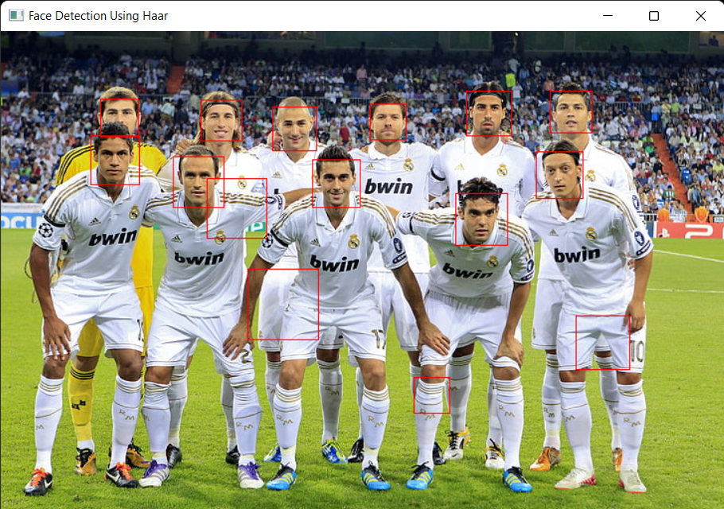

## Basic Face Detection
The detection of the face is an essential feature for this monitoring system. Though this detection could serve as an attendance recording procedure at the intial stage of the monitoring process, the availability of the student through out the monitoring session is highly important.
Also, the monitoring system ensures that the student solely does his work. Here is when the detection of multiple faces comes to play.

#### HAAR Classifier with AdaBoost algorithm
- Less Detection Reliablity
  - Detection of Non-Faces as Faces at some instances
  - No detection of faces when the lighting is less  
  

Thus, a convolutional neural network was attempted to be employed.
#### Multi-Task Convolution Neural Network (MTCNN)
- The MTCCN detection is capable of detecting the face under a considerably less lighting with higher reliability than the boosted HAAR classifier. 
  - Some of the detections under less lightning are shown below.
